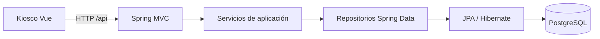

# LockerOps Platform

API REST de demostración para estaciones de lockers, compartimentos,
reservas, pagos simulados y tickets. El proyecto incluye un
[kiosco asociado](https://github.com/jaikostatham/lockerops-kiosk-frontend).

La demo expone el catálogo y el flujo del quiosco: crear una reserva, simular su
pago y validar el código de acceso. El pago no procesa tarjetas ni realiza
cobros reales. En los perfiles desplegados, la API oculta las operaciones
administrativas del catálogo y las consultas de colecciones privadas.

## Tecnologías

Java 21 · Spring Boot 3 · Gradle · Spring Data JPA · Hibernate · Flyway ·
PostgreSQL · H2 para pruebas

## Entornos

La aplicación obtiene la conexión de base de datos de variables de entorno. El
perfil `testing` usa `DB_NAME_TESTING` (por defecto, `lockerops_test`) y el
perfil `prod` usa `DB_NAME_PROD` (por defecto, `lockerops_prod`). El backend
local puede ejecutarse con el perfil de Testing para que sus operaciones
escriban en la base de pruebas.

## Arquitectura

El código se organiza por funcionalidades: `station`, `compartment`,
`reservation`, `payment` y `ticket`. La aplicación también contiene el contrato común
de errores y la configuración transversal.

## API

El [contrato HTTP](docs/api-contract.md) recoge rutas, ejemplos de payloads y
respuestas. La [vista de arquitectura](docs/architecture-overview.md) describe
los módulos y los flujos principales.
