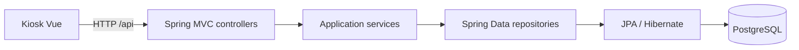

# LockerOps Platform

API REST para gestionar estaciones de lockers, compartimentos, reservas, tickets
y códigos de acceso. Este repositorio contiene el backend Java; el kiosk Vue vive
en [lockerops-kiosk-frontend](https://github.com/jaikostatham/lockerops-kiosk-frontend).

El proyecto está en desarrollo y sirve como portfolio técnico. La API implementa
operaciones CRUD y flujos de reserva. Los perfiles públicos de la demo solo
permiten consultar el catálogo; el flujo de reserva se utiliza en local. No uses
datos personales reales en una demo pública.

## Tecnologías y arquitectura

- Java 21, Spring Boot, Gradle, Spring Data JPA, Flyway y PostgreSQL.
- H2 para los tests de integración.
- OpenAPI/Swagger para explorar los contratos.
- Arquitectura por vertical slices: `station`, `compartment`, `reservation` y `ticket`.



La API mantiene sus contratos y errores documentados en
[`docs/api-contract.md`](docs/api-contract.md). Entre sus rutas principales están
`GET /api/locker-stations`, `GET /api/locker-stations/{id}/compartments` y
`POST /api/reservations`.

## Ejecutar en local

Requisitos: Java 21 y PostgreSQL en `localhost:5432`. La contraseña de PostgreSQL
se proporciona desde el gestor de secretos o el entorno del proceso; no se guarda
en este repositorio.

```powershell
$env:SPRING_PROFILES_ACTIVE = 'local'
$env:DB_NAME = 'lockerops_test'
.\gradlew.bat bootRun
```

La API escucha normalmente en `http://localhost:8080`. Swagger UI queda en
`/swagger-ui/index.html`.

## Entornos

| Perfil | Base | Uso |
| --- | --- | --- |
| `local` | `lockerops_test` | Backend que ejecuta el desarrollador |
| `testing` | `lockerops_test` | Instancia local o desplegada para validar cambios |
| `prod` | `lockerops_prod` | Entorno de portfolio; requiere credenciales y origen CORS explícitos |
| `test` | H2 | Tests automatizados |

`local` y `testing` comparten los mismos datos solo si se conectan a la misma
instancia de PostgreSQL. Ahora el backend local usa PostgreSQL en este equipo;
todavía no existe una base de testing alojada. No expongas el puerto 5432 a
Internet para conectarlos.

La guía de configuración, copias y migraciones está en
[`docs/postgresql-environments.md`](docs/postgresql-environments.md).

## Verificación

```powershell
.\gradlew.bat test
.\gradlew.bat build
```

GitHub Actions ejecuta `./gradlew build --no-daemon` en `develop`, `main` y los
Pull Requests hacia esas ramas. El workflow comprueba el backend; todavía no
despliega la aplicación ni crea URLs remotas.

## Seguridad de la demo

Los perfiles remotos bloquean las escrituras y solo exponen la lectura de
estaciones y compartimentos. `prod` requiere secretos externos, TLS, un usuario de
migración y un origen CORS explícito. Como la API no incorpora autenticación,
mantén exclusivamente datos sintéticos y no cargues reservas reales en una demo.
