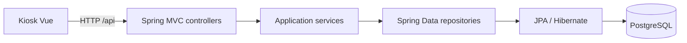

# LockerOps Platform

API REST de demostración para gestionar estaciones de lockers, compartimentos,
reservas y tickets. El proyecto asociado de interfaz es
[LockerOps Kiosk](https://github.com/jaikostatham/lockerops-kiosk-frontend).

La demo pública expone un catálogo sintético en modo de solo lectura.

## Tecnologías y arquitectura

- Java 21, Spring Boot, Gradle, Spring Data JPA, Flyway y PostgreSQL.
- H2 para pruebas automatizadas.
- OpenAPI para explorar el contrato durante el desarrollo local.
- Organización por funcionalidades: `station`, `compartment`, `reservation` y `ticket`.



El contrato funcional está resumido en [`docs/api-contract.md`](docs/api-contract.md).
La demo pública permite consultar estaciones y compartimentos; las operaciones
de reserva y acceso forman parte del flujo de desarrollo y no se habilitan en
esa demo.

## Ejecutar en local

Requisitos: Java 21 y una instancia de PostgreSQL para desarrollo. Configura el
perfil `local` y los valores `DB_HOST`, `DB_PORT`, `DB_NAME`, `DB_USERNAME` y
`DB_PASSWORD` en la configuración local del entorno. La API usa esas variables
para conectarse a la base de datos y Hibernate valida el esquema al arrancar.

Las migraciones versionadas se ejecutan por separado del arranque de la API. En
una base local que necesite actualizar el esquema, ejecuta `flywayMigrate` con
`DB_HOST`, `DB_NAME`, `DB_MIGRATION_USERNAME` y `DB_MIGRATION_PASSWORD`; el
puerto y el modo SSL usan los valores `DB_PORT` y `DB_SSLMODE`.

```powershell
$env:SPRING_PROFILES_ACTIVE = 'local'
.\gradlew.bat flywayMigrate
.\gradlew.bat bootRun
```

La API escucha normalmente en `http://localhost:8080`. Durante el desarrollo,
OpenAPI UI está disponible en `/swagger-ui/index.html`.

## Verificación

Desde la carpeta del backend:

```powershell
.\gradlew.bat test
.\gradlew.bat build
```

En GitHub Actions, los cambios en PR y los pushes a `develop` o `main` ejecutan
compilación y pruebas. La tarea `flywayMigrate` queda disponible para aplicar
migraciones cuando una modificación del proyecto cambie el esquema.

## Datos y seguridad

Los entornos compartidos usan datos sintéticos. Las credenciales se suministran
mediante la configuración privada del entorno de ejecución. La configuración
del frontend no sustituye las restricciones que aplica la API.
