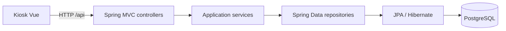

# LockerOps Platform

API REST para gestionar estaciones de lockers, compartimentos, reservas, tickets y
códigos de acceso. El kiosco Vue vive en
[lockerops-kiosk-frontend](https://github.com/jaikostatham/lockerops-kiosk-frontend).

Este portfolio usa datos ficticios. Los servicios públicos de testing y producción
solo exponen el catálogo de estaciones y compartimentos; no uses datos personales
reales.

## Tecnologías y arquitectura

- Java 21, Spring Boot 3.5.14, Gradle, Spring Data JPA, Flyway y PostgreSQL.
- H2 para los tests de integración.
- OpenAPI/Swagger para explorar los contratos en local.
- Arquitectura por vertical slices: `station`, `compartment`, `reservation` y `ticket`.



La API mantiene sus contratos en [`docs/api-contract.md`](docs/api-contract.md).
Rutas principales: `GET /api/locker-stations`,
`GET /api/locker-stations/{id}/compartments` y `POST /api/reservations`.

## Entornos

| Entorno | Rama y servicio | Base |
| --- | --- | --- |
| Local | Perfil `local`; PostgreSQL en `localhost:5432` por defecto | `lockerops_test` local |
| Testing | `develop`; API y kiosco en Render | Neon `lockerops-test` / rama `testing` / `lockerops_test` |
| Producción | `main`; API y kiosco en Render | Neon `lockerops-prod` / rama `production` / `lockerops_prod` |
| Tests | Perfil `test` | H2 en memoria |

La base PostgreSQL local y Neon `lockerops_test` son instancias distintas aunque
compartan nombre. IntelliJ puede sobrescribir el host y el nombre de la conexión local.

Servicios públicos:

- Testing: [kiosco](https://lockerops-kiosk-frontend-test.onrender.com/stations) ·
  [API](https://lockerops-platform-test.onrender.com/api/locker-stations)
- Producción:
  [kiosco](https://lockerops-kiosk-frontend-prod.onrender.com/stations) ·
  [API](https://lockerops-platform-prod.onrender.com/api/locker-stations)

Los perfiles remotos son de solo lectura y solo permiten consultar el catálogo.
Swagger UI y `/v3/api-docs` están desactivados en esos perfiles.

## Ejecutar en local

Requisitos: Java 21 y PostgreSQL. Configura `DB_PASSWORD` y, si hace falta,
`DB_USERNAME` en el entorno seguro de IntelliJ o del proceso; no guardes credenciales
en este repositorio.

```powershell
$env:SPRING_PROFILES_ACTIVE = 'local'
$env:DB_HOST = 'localhost'
$env:DB_PORT = '5432'
$env:DB_NAME = 'lockerops_test'
$env:DB_SSLMODE = 'disable'
.\gradlew.bat bootRun
```

La API escucha normalmente en `http://localhost:8080`. Swagger UI local está en
`/swagger-ui/index.html`.

## Verificación

Desde la carpeta del backend:

```powershell
.\gradlew.bat test
.\gradlew.bat build
```

GitHub Actions ejecuta `./gradlew build --no-daemon`.

## Flujo de cambios

Trabaja en una rama `feature/...`, `fix/...` o `docs/...` creada desde `develop`;
abre un Pull Request a `develop` y revisa CI antes de integrar. Después valida en
Testing. La promoción a Producción se hace en un Pull Request separado de
`develop` a `main`.

Render aloja los servicios y gestiona sus despliegues. Consulta
[`docs/deployment-pipeline.md`](docs/deployment-pipeline.md) y
[`docs/postgresql-environments.md`](docs/postgresql-environments.md) para el
procedimiento completo.

## Seguridad de la demo

Los backends remotos no incorporan autenticación: sus permisos y perfiles limitan
las operaciones al catálogo público. CORS no sustituye autenticación. Mantén
únicamente datos sintéticos; las credenciales permanecen en los gestores de
secretos de los servicios.
