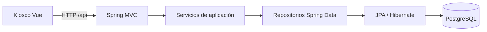

# LockerOps Platform

API REST de demostración para estaciones de lockers, compartimentos,
reservas y tickets. El proyecto incluye un [kiosco asociado](https://github.com/jaikostatham/lockerops-kiosk-frontend).

La instancia pública ofrece un catálogo ficticio de estaciones y compartimentos.
Los perfiles desplegados limitan la API a ese catálogo; los flujos de reservas,
tickets y códigos de acceso forman parte de la aplicación y se ejercitan en
desarrollo y en las pruebas automatizadas.

## Tecnologías

Java 21 · Spring Boot 3 · Gradle · Spring Data JPA · Hibernate · Flyway ·
PostgreSQL · H2 para pruebas

## Arquitectura

El código se organiza por funcionalidades: `station`, `compartment`,
`reservation` y `ticket`. La aplicación también contiene el contrato común
de errores y la configuración transversal.

## API

El [contrato HTTP](docs/api-contract.md) recoge rutas, ejemplos de payloads y
respuestas. La [vista de arquitectura](docs/architecture-overview.md) describe
los módulos y los flujos principales.
