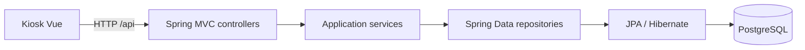

# LockerOps Platform

API REST de demostración para gestionar estaciones de lockers, compartimentos,
reservas y tickets. El proyecto asociado de interfaz es
[LockerOps Kiosk](https://github.com/jaikostatham/lockerops-kiosk-frontend).

La demo pública usa datos ficticios y está limitada a la consulta del catálogo.
No introduzcas datos personales ni credenciales reales.

## Tecnologías y arquitectura

- Java 21, Spring Boot, Gradle, Spring Data JPA, Flyway y PostgreSQL.
- H2 para pruebas automatizadas.
- OpenAPI para explorar el contrato durante el desarrollo local.
- Organización por funcionalidades: `station`, `compartment`, `reservation` y `ticket`.



El contrato funcional está resumido en [`docs/api-contract.md`](docs/api-contract.md).
La demo pública permite consultar estaciones y compartimentos; las operaciones
de reserva y acceso forman parte del flujo de desarrollo y no se habilitan en
esa demo.

## Ejecutar en local

Requisitos: Java 21 y una instancia de PostgreSQL para desarrollo. Configura el
perfil `local` y los valores `DB_HOST`, `DB_PORT`, `DB_NAME`, `DB_USERNAME` y
`DB_PASSWORD` en la configuración local de tu entorno. No guardes credenciales
en el repositorio.

```powershell
$env:SPRING_PROFILES_ACTIVE = 'local'
.\gradlew.bat bootRun
```

La API escucha normalmente en `http://localhost:8080`. Durante el desarrollo,
OpenAPI UI está disponible en `/swagger-ui/index.html`.

## Verificación

Desde la carpeta del backend:

```powershell
.\gradlew.bat test
.\gradlew.bat build
```

## Datos y seguridad

Usa datos sintéticos en entornos compartidos. Mantén contraseñas y otros secretos
en la configuración privada del entorno de ejecución; no los incluyas en el
código, documentación, capturas ni historial de Git. La configuración del
frontend no sustituye las restricciones que aplica la API.
